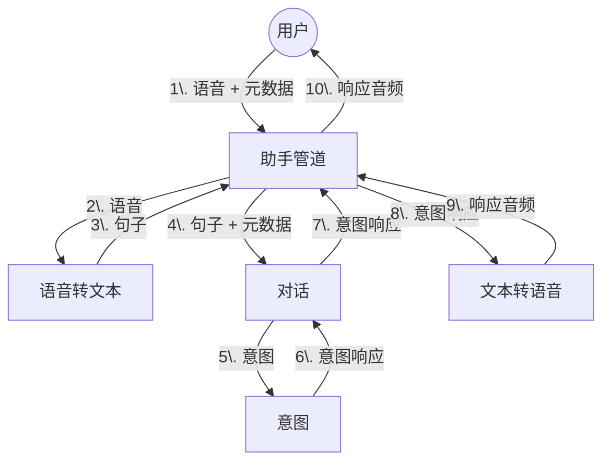

构建一个语音助手是一项复杂的任务。它需要许多不同的技术协同工作。此页面将为您提供 Home Assistant 内部不同部分的概述，以及它们如何协同工作。

- **助手管道** 集成负责将用户的语音转换为文本，进行处理，然后将响应转换为语音。
- **对话** 集成负责处理用户的文本。内置的对话代理通过与意图匹配来完成此操作。集成可以提供 [自定义对话代理](../core/entity/conversation)。
- **意图** 集成负责执行意图并返回响应。
- **文本转语音** 集成负责将文本转换为语音。集成可以提供 [自定义文本转语音代理](../core/entity/tts)。
- **语音转文本** 集成负责将语音转换为文本。集成可以提供 [自定义语音转文本代理](../core/entity/stt)。

## 捕获用户的语音

上面的图表没有描述的是如何捕获用户的语音。这将有许多方式来实现。

最终目标是制作 **语音卫星**。这些设备可以放置在房子的任何地方。一旦检测到热词，它将捕获用户的语音，发送至 Home Assistant，并将响应播放回用户。